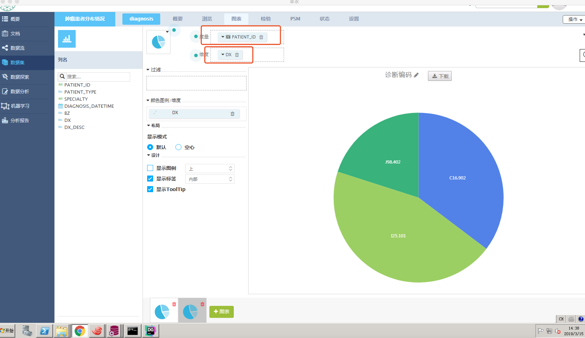
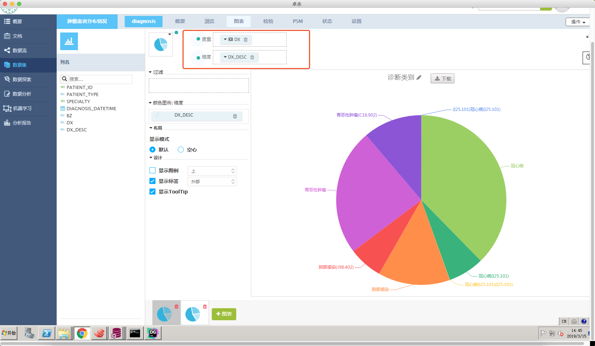
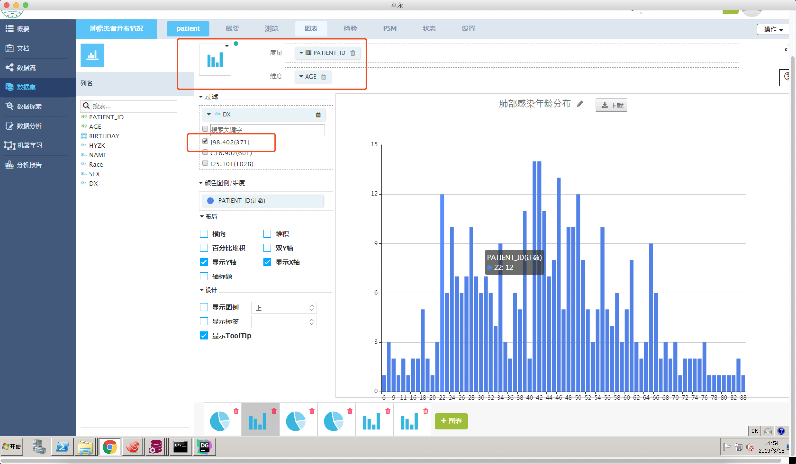

# 肿瘤患者分布情况

## 需求

1. 就诊患者中排名患病最多的前三种病种，前三种病种的男女、年龄分布。
2. 肿瘤患者排名最前的三种类型，及其男女、年龄分布。


## 分析

1. 首先要找到前三的病种，由于诊断描述太杂，所以根据诊断编码 `dx` 来过滤

```oracle
select dx
from (
           select d.DX, count(1) as count
           from DIAGNOSIS1 d
           where d.dx is not null
           group by d.DX
           order by count(1) desc
    )
where ROWNUM <= 3
```

2. 查询病种前三的患者

```oracle
select distinct to_char(trunc(p.PATIENTID)) as patient_id,
                to_char(trunc(p.AGE))as age,
                p.BIRTHDAY,
                p.HYZK,
                p.NAME,
                p."Race",
                p.SEX,
                d.DX
from PATIENT1 p
            join DIAGNOSIS1 d on to_char(trunc(p.PATIENTID)) = d.PATIENT_ID
where d.DX in (
       select dx
       from (
                   select d.DX, count(1) as count
                   from DIAGNOSIS1 d
                   where d.dx is not null
                   group by d.DX
                   order by count(1) desc
            )
       where ROWNUM <= 3
)
```

3. 查询病种前三的诊断


```oracle
select * from DIAGNOSIS1 d
where d.DX in (
       select dx
       from (
                   select d.DX, count(1) as count
                   from DIAGNOSIS1 d
                   where d.dx is not null
                   group by d.DX
                   order by count(1) desc
            )
       where ROWNUM <= 3
)
```


## 画图

1. 诊断编码

选择饼图，以 `dx` 为维度，`CNT PATIENT_ID`为度量，（即以`PATIENT_ID` 计数）
 
```oracle
-- 逻辑
SELECT
  count(PATIENT_ID),
  dx
FROM patient
GROUP BY dx
```


2. 诊断类别

选择饼图，以 `dx_desc` 为维度，`CNT PATIENT_ID`为度量，（即以`PATIENT_ID` 计数）

```oracle
-- 逻辑
SELECT
  count(PATIENT_ID),
  dx_desc
FROM patient
GROUP BY dx_desc
```


3. 性别分布

选择饼图，以 `sex` 为维度，`CNT PATIENT_ID`为度量，（即以`PATIENT_ID` 计数）, 以 `dx` 下拉选项中选择 `J98.402` 过滤，代表过滤肺部感染的患者，其他的类似，就是过滤的选项换下

```oracle
-- 逻辑
SELECT
  count(PATIENT_ID),
  sex
FROM patient
WHERE dx = 'J98.402'
GROUP BY sex
```


4. 年龄分布

选择柱状如，以 `age` 为维度，`CNT PATIENT_ID`为度量，（即以`PATIENT_ID` 计数）, 以 `dx` 下拉选项中选择 `J98.402` 过滤，代表过滤肺部感染的患者，其他的类似，就是过滤的选项换下



```oracle
-- 逻辑
SELECT
  count(PATIENT_ID),
  age
FROM patient
WHERE dx = 'J98.402'
GROUP BY age
```
